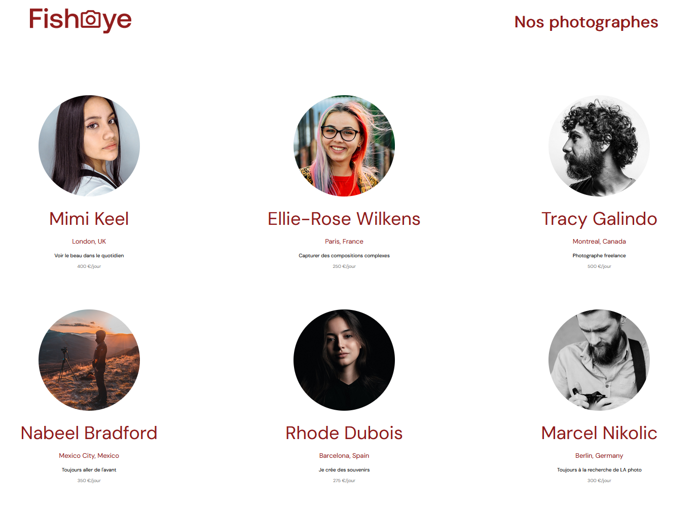

# FishEye - Prototype Frontend


## 🏷️ Badges


## 📖 Contexte

FishEye est un site web qui permet aux photographes indépendants de présenter leurs meilleurs travaux.  
Ce projet est réalisé dans le cadre de ma formation de développeur front-end.  
L’objectif : intégrer un prototype complet à partir de maquettes fournies, en respectant les bonnes pratiques d’**accessibilité** et en utilisant du **JavaScript orienté objet**.

---

## 🖼️ Capture d’écran
 



## 🎯 Objectifs du projet

- Créer une **page d’accueil** listant les photographes.  
- Créer une **page photographe** affichant sa galerie (photos et vidéos).  
- Gérer les données dynamiquement à partir d’un **fichier JSON**.  
- Mettre en place un **système de tri** (popularité, date, titre).  
- Implémenter une **lightbox accessible** (clavier, ESC, focus trap).  
- Ajouter un **formulaire de contact** accessible et validé en JS.  
- Respecter les contraintes techniques : **Factory Method** pour gérer photos/vidéos.

---

## 🛠️ Technologies utilisées

- **HTML5** (sémantique, conforme W3C)  
- **CSS3** (modulaire, responsive, flexbox/grid)  
- **JavaScript ES6** (modules, classes, factory method)  
- **JSON** (données simulées côté front)

---

## 📂 Structure du projet

```bash
├── index.html
├── photographer.html
├── .eslintrc.js             # Configuration ESLint
├── .prettierrc.json         # Configuration Prettier
│
├── /assets                  # Images, logos, captures d’écran
│
├── /css
│   ├── style.css            # Styles généraux
│   └── photographer.css     # Styles spécifiques page photographe
│
├── /data
│   └── photographers.json   # Données JSON des photographes et médias
│
├── /js
│   ├── factories
│   │   └── mediaFactory.js  # Factory Method pour gérer photos/vidéos
│   │
│   ├── pages
│   │   ├── index.js         # Logique page d’accueil
│   │   └── photographer.js  # Logique page photographe
│   │
│   ├── template
│   │   └── photographer.js  # Template DOM pour afficher un photographe
│   │
│   └── utils
│       ├── api.js           # Gestion récupération données JSON
│       └── contactForm.js   # Gestion et validation du formulaire
│
└── README.md

🚀 Lancer le projet
Cloner le repo :
git clone https://github.com/MTDev2024/FishEye.git
Ouvrir le fichier index.html directement dans le navigateur.


♿ Accessibilité
Navigation au clavier (Tab, Entrée, ESC, flèches).

Lightbox avec focus trap et fermeture clavier.

Texte alternatif (alt) sur toutes les images.

Rôles ARIA sur les composants interactifs.

📸 Démonstration des fonctionnalités
Tri dynamique (popularité, date, titre)

Lightbox pour parcourir les médias

Compteur de likes mis à jour dynamiquement


---


   ```